# แนะนำตัว
ชื่อ-นามสกุล : นางสาวธนัชชา ขุนทอง

รหัสนักศึกษา : 603020472-3

หลักสูตร : สารสนเทศสถิติ

# หัวข้อนำเสนอ
1. How to install Python
2. การใช้งาน Google Colab
3. การใช้งาน Github

# 1.How to install Python
1. ขั้นตอนแรกเราจะต้องทำการ Download Miniconda กันก่อน ซึ่งสามารถโหลดได้จาก https://conda.io/en/latest/miniconda.html
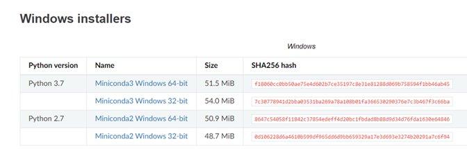
    -	เลือก Ver. ที่ต้องการได้เลย (แนะนำ Python 3.7 ใหม่ล่าสุด)
2. ทำการติดตั้ง Miniconda
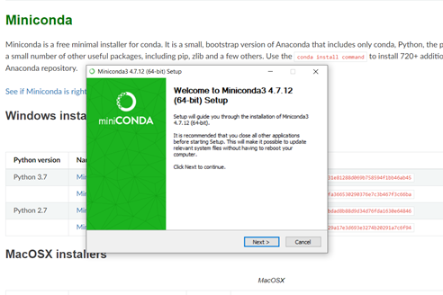
3.	เมื่อติดตั้ง Miniconda เสร็จสิ้นแล้วให้ทำการเปลี่ยนภาษาของเครื่องเป็น English(United Staes) 
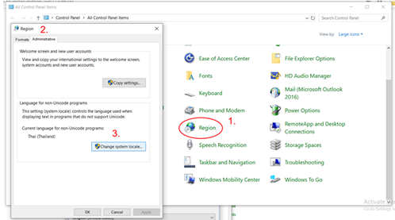
    -	Control Panal > Region > Administrative > Chage system locale
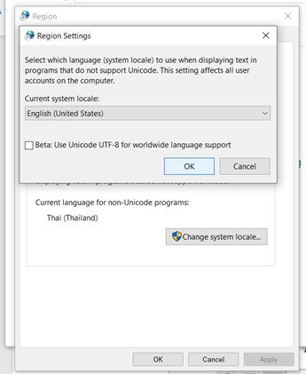
    -	เปลี่ยนภาษาเป็น English(United Staes) แล้วกด OK จากนั้นทำการ Restart เครื่อง
4.	ทำการสร้าง Folder ใหม่ในการเก็บไฟล์งานของ Python เพื่อให้เก็บงานได้เป็นระเบียบและหาได้ง่าย
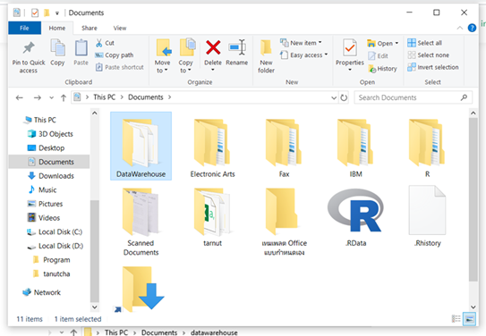
5.	คัดลอกที่อยู่ของ Folder โดยการคลิกที่แถบที่อยู่ 1 ครั้ง แล้วกด Ctrl + C
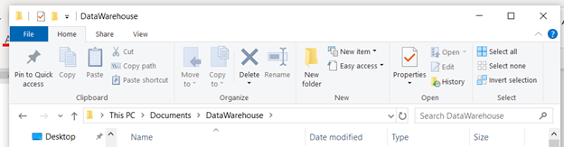
6.	ทำการเปิด Anaconda Prompt แล้วเปลี่ยน Directory เพื่อให้โปรแกรมรู้ที่อยู่ของ Folder งาน โดยการพิมพ์ cd เว้นวรรค “ที่อยู่ของFolder งาน ที่คัดลอกไว้ในข้อ 5” แล้วกด Enter
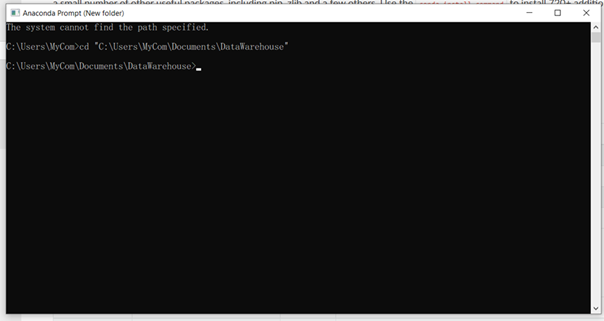
7.	เช็คดูว่ามีการติดตั้ง Python ไว้ในเครื่องหรือยัง โดยการพิมพ์ Python แล้วกด Enter
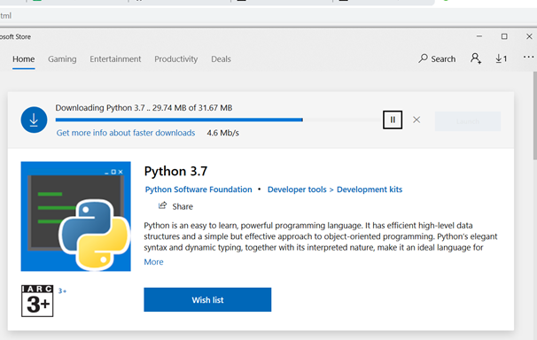
    
        **** หากไม่มีการติดตั้ง Python ไว้ในเครื่อง ให้ทำการ Download และติดตั้ง ซึ่งระบบจะขึ้นหน้าต่าง Download มาให้เลย เสร็จสิ้นแล้วให้เช็คดูอีกครั้ง'
8.	เสร็จสิ้นการ Install Python ง่ายๆ

# 2.การใช้งาน Google Colab
    Google Colab เป็นโปรเจ็คที่พัฒนาโดยทีม Google Research ที่เปิดให้นักศึกษาและคนทั่วไปที่อยากเริ่มเขียนโค้ด Python ใช้งานได้ฟรีผ่าน Google Chrome Browser หากยังไม่มี Chrome จะต้อง Download และ install ก่อน
Google Colab มีการใช้งานอย่างไรไปดูกันเลย 
1.	เข้าไปที่ เว็บไซต์ Google Colab ซึ่งก่อนการใช้งานจะต้องลงชื่อเข้าใช้ Google ด้วย Email ก่อนทุกครั้ง
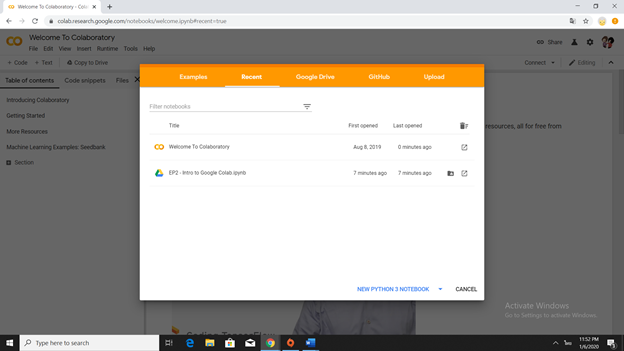
2.	เมื่อต้องการเริ่มเขียน Python ให้ไปที่ File > New Python 3 notebook ดังรูป
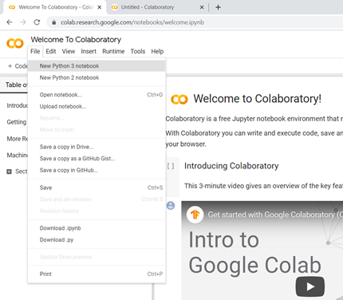
3. จากนั้นจะได้หน้าต่างการใช้งานดังรูป แล้วเริ่มลงมือเขียน Code ได้เลย
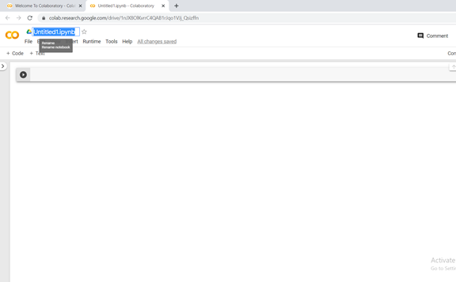
    -	สามารถตั้งชื่อไฟล์ได้ตรงช่องที่เน้นสีฟ้าไว้ดังรูปข้างบน (Untitled1.ipynb)

# 3.การใช้งาน Github
 เราจะใช้งาน Github ได้อย่างไร?
 1.	เข้าไปที่ เว็บไซต์ https://github.com/  แล้วสมัครเข้าใช้งาน “แบบ public(ฟรี)” 
 
    -	กรอกข้อมูลในการสมัครเข้าใช้งานในกรอบสีแดง
2.	จากนั้น Activate การสมัครผ่านทาง Email ที่เราใช้สมัคร เสร็จแล้วลงชื่อเข้าใช้งาน
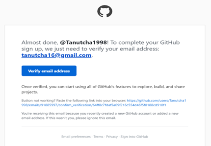
3.	เมื่อทำการสมัครและลงชื่อเข้าใช้เสร็จสิ้นแล้ว ก็เริ่มต้นใช้งานได้เลย โดยไปที่สัญลักษณ์เครื่องหมายบวก(+) > New repository เพื่อทำการสร้างที่จัดเก็บ

4.	ทำการสร้าง Repository โดยใส่รายละเอียดดังนี้
    -	Repository name -> ตั้งชื่อ Repository
    -	Description -> รายละเอียดเกี่ยวกับ Repository
    -	เลือกความเป็นส่วนตัวที่ต้องการระหว่าง Pubilc (คือทุกคนสามารถเข้ามาดูได้) หรือ Private (คือเมื่อต้องการให้เป็นส่วนตัว)
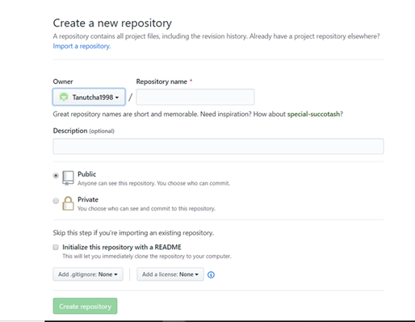

แล้ว Github ใช้งานอย่างไร?
1.	Download & Install โปรแกรม Visual Studio Code จากเว็บไซต์ https://code.visualstudio.com/
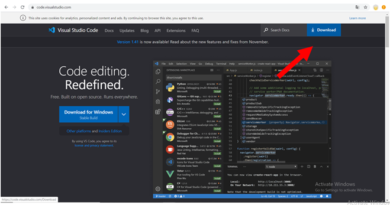
2.	ติดตั้ง Github ใน Anaconda prompt โดยพิมพ์ conda install -c anaconda git
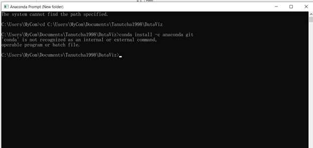
3.	ทำการเชื่อมไฟล์เข้ากับ Github โดยพิมพ์ git clone ตามด้วยที่อยู่ลิงค์ของGithub ที่ทำการ copy ไว้
4.	คำสั่งเบื้องต้นของ Github
    -	git status ใช้เพื่อตรวจสอบดูว่าไฟล์ใดยังไม่เชื่อมกับGithubบ้าง
    -	git add “ชื่อไฟล์” ใช้เพื่อเพิ่มไฟล์เข้าไป
    -	git commit -m “…” ใช้เป็นคำสั่งในการcommit
    -	git push ใช้ในการอัพงานไปโพสในGitbub

    -----------เสร็จสิ้น-------------
